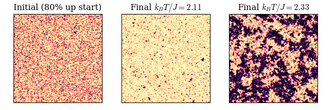
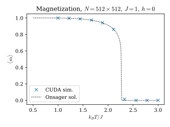
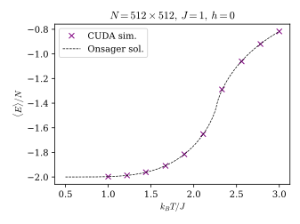

# Parallel 2D Ising - Modern Computing for Physics 


<div style="display: flex; justify-content: space-between;">
  <div>
    
  </div>
  <div>
    
  </div>
</div>

Monte Carlo simulation of the 2D Ising model implementing both sequential C and parallel CUDA versions. The Glauber (single spin) Metropolis proposal is parallelized with checkerboard decomposition for race-free updates, optimized CUDA kernels with shared memory and coalesced access patterns, and parallel reduction for energy and magnetization calculations. The code was built and tested on the Jetson Nano board.

## File Structure

```
├── bin/              # Compiled executables
│   ├── parallel
│   └── serial
├── src/              # Source code
│   ├── parallel.cu   # CUDA parallel implementation
│   ├── serial.c      # Sequential code
│   ├── ising.h       # Header file for parallel code
│   ├── ising_kernels.cu  # CUDA kernel implementations
│   ├── ising_utils.cu    # CUDA utility functions
│   └── Makefile      # Build configuration
├── data/             # Simulation results and performance data
└── postproc/
    ├── performance.ipynb  # Performance analysis
    ├── physics.ipynb     # Physics results analysis
    └── plots/            # Benchmarks and phsyics visualizations
```

## Usage

**Build CUDA:**
```bash
cd src && make
```

**Build serial:**
```bash
cd src && gcc -O3 -march=native -flto -o ../bin/serial serial.c -lm
```

**Run Serial:**
```bash
./bin/serial <grid_size> <temperature> <steps> <opt. args>
```
Run 
```bash
./bin/serial --help
```
for a detailed list of command line arguments

**Run Parallel:**
```bash
./bin/parallel <grid_size> <temperature> <steps> <opt. args>
```
Run 
```bash
./bin/parallel --help
```
for a detailed list of command line arguments